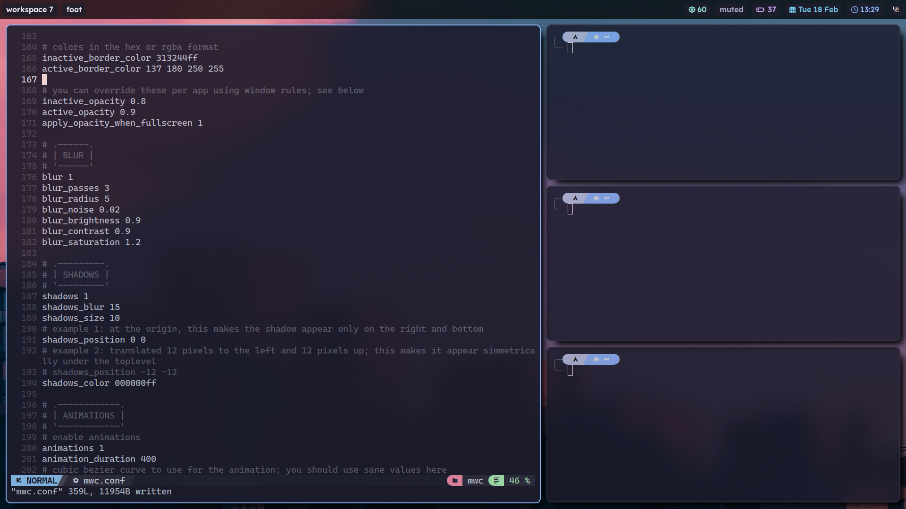
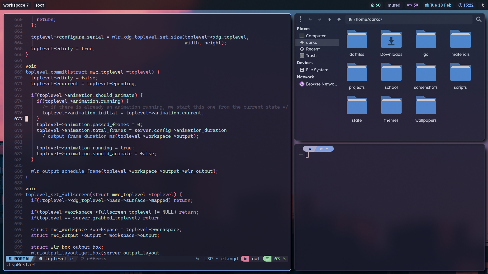
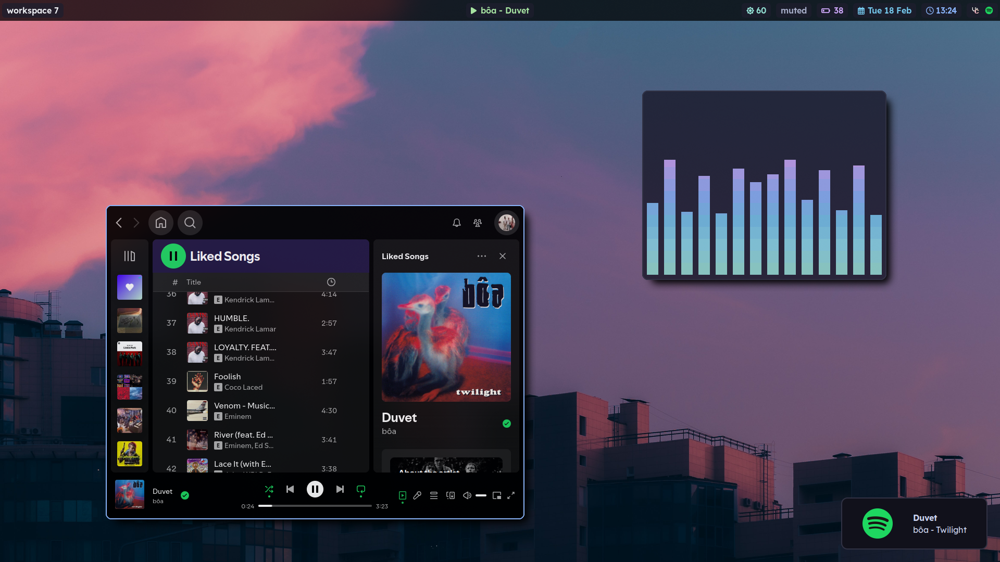

<div align="center">
  <h1>mwc</h1>
  
  <br>
</div>
<br>

## features
- tiling and floating toplevels
- master layout with support for multiple masters, ideal for wide monitors
- keyboard focused workflow
- great multitasking with multimonitor and workspaces support
- smooth and customizable animations
- easy configuration with hot reloading on save
- eye-candy (opacity, blur, rounded corners and shadows)
- portals and an ipc for integrating with other apps

## dependencies
- meson *
- ninja *
- wayland-protocols *
- wayland
- libinput
- libdrm
- pixman
- libxkbcommmon
- wlroots 18.0 
- scenefx 0.2

> \* compile-time dependencies

## building
install the dependencies and then run
```bash
git clone https://github.com/dqrk0jeste/mwc
cd mwc
meson setup build
ninja -C build
```

## installation

### arch
`mwc` is available in the arch user repository as `mwc` (versioned releases) and `mwc-git` (latest features). you can install it with your favourite aur helper
```bash
yay -S mwc
```

### other distros
```bash
git clone https://github.com/dqrk0jeste/mwc
cd mwc
meson setup build --prefix=/usr/local --buildtype=release
ninja -C build install
```

## post install
if you need to interact with sandboxed applications and/or screenshare you will need xdg-desktop-portals. by default `mwc` needs
- xdg-desktop-portal (base)
- xdg-desktop-portal-wlr (for screensharing)
- xdg-desktop-portal-gtk (for everything else)

## usage
```bash
mwc
```

> you probably want to run it from a tty

## configuration
configuration is done in a configuration file found at `$XDG_CONFIG_HOME/mwc/mwc.conf` or `$HOME/.config/mwc/mwc.conf`. if no config is found a default config will be used (you need `mwc` installed, see above).

> note: you can use other configuration location by setting `MWC_CONFIG_PATH` before running `mwc`.

for detailed documentation see `examples/example.conf`. you can also find the default config in the repo.

## gallery
<div align="center">


</div>

